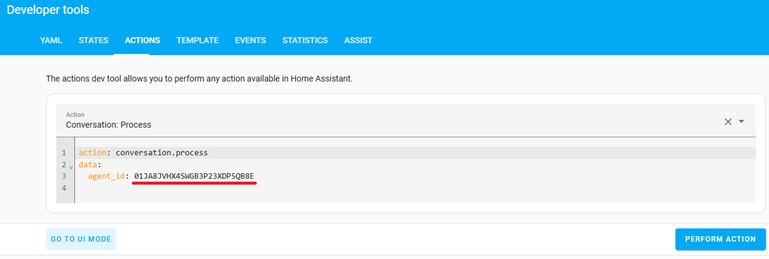

## INSTALLATION

### Setting up Home Assistant
- Enable the Home Assistant API for your user and obtain a long-lived access token.

### Creating the Alexa Skill

1. Create a Skill in the [Alexa Developer Console](https://developer.amazon.com/alexa/console/ask) by following the steps below:
   - **Name your Skill**: Choose a name of your preference (e.g., Home Assistant Assist)
   - **Choose a primary locale**: Portuguese (BR)
   - **Choose a type of experience**: Other
   - **Choose a model**: Custom
   - **Hosting services**: Alexa-hosted (Python)
   - **Hosting region**: US East (N. Virginia) is the default, but you must use the same region where you created the AWS account and configured IAM [Instructions here](https://www.home-assistant.io/integrations/alexa.smart_home)
   - **Templates**: Click on `Import skill`
   - **Insert the address**: [https://github.com/fabianosan/HomeAssistantAssist.git](https://github.com/fabianosan/HomeAssistantAssist.git) and click `Import`
2. Go to the **Code** tab.
3. Insert your information into the configuration file as instructed below:
   - Open the `config.cfg` file in the project's root directory (/Skill Code/lambda/).
   - Insert the following information:
     ```txt
     home_assistant_url=https://YOUR-HOME-ASSISTANT-EXTERNAL-URL
     home_assistant_token=YOUR-HOME-ASSISTANT-TOKEN
     home_assistant_agent_id=YOUR-AGENT-ID
     home_assistant_language=pt-BR
     home_assistant_room_recognition=False
     home_assistant_dashboard=YOUR-DASHBOARD-ID
     home_assistant_kioskmode=False
     ```
   - **home_assistant_url**: External URL of your Home Assistant (root path).
   - **home_assistant_token**: Long-lived access token for your Home Assistant.
   - **(optional) home_assistant_agent_id**: Conversation agent ID configured in your Home Assistant; if not set, Assist will be used (Default).
   - **(optional) home_assistant_language**: Language to call the Home Assistant conversation API. If not set, the agent's default language will be used.
   - **(optional) home_assistant_room_recognition**: Enable device area recognition mode with `True`. **Attention**, it only works with AI; if you're using the default Assist, disable this option, as no command will work.
   - **(optional) home_assistant_dashboard**: Dashboard path to display on Echo Show, e.g., `mushroom`; if not set, "lovelace" will be loaded.
   - **(optional) home_assistant_kioskmode**: Enable kiosk mode with `True`. **Attention**, only activate this option if you have the component installed.
4. If desired, change the default skill responses in the `/locale/en-US.lang` file or another supported language.
5. Save the changes.
6. Click on `Deploy`.

### Obtaining the `home_assistant_agent_id` from Assist or the generative AI (if you are using one):

- Navigate to **Developer Tools**, go to the `Actions` tab, and follow the steps below: 
1. Search for `conversation.process` in the action field and select it:

  

2. Enable the `Agent` field and select the desired conversation agent from the list:

  

3. Switch to `YAML MODE` and copy the ID from the `agent_id` field:

  

### Obtaining the `home_assistant_token` (Long-Lived Token):

- With your Home Assistant open, go to your user profile in the bottom-left corner, click on it, and then go to the `Security` tab at the top:
  1. At the bottom of the page, click the `CREATE TOKEN` button:
  2. Enter a name that you find appropriate, e.g., `Home Assistant Skill Assist` and click `OK`:

    

  1. Copy the token:

    

  4. Place the generated token in the configuration

### Setting the ``Invocation Name``

- The default invocation name set in the code is "smart house."
- To change the invocation name:
  1. Go to the **Build** tab.
  2. Click on `Invocations` and then on `Skill Invocation Name`.
  3. Enter the desired new invocation name and save the changes (test if this wake word can be used in the **Test** tab).
  4. Rebuild the model by clicking on `Build skill` if you make changes.
  
### Publishing the Skill

1. After deploying the code in the **Code** tab, return to the **Build** tab and click on **Build skill**.
2. Then go to the **Alexa** app on your phone: `More` > `Skills & Games` > scroll to the bottom and click on `Your Skills` > `Dev.`, click on the skill you just created and **activate** it.

    
    
3. Go back to the ``Alexa Developer Console`` and test the Skill in the **Test** tab to ensure the wake word and skill are working correctly.

### Enabling room recognition (works only with AI)
- In this mode, the skill sends the device ID (from the `Echo` device running the skill) in the Home Assistant conversation API call. Then, with a command instruction for the AI and a label associated with the device, the AI can identify the devices in the same area where your `Alexa` is located. To enable it, follow the steps below:

  ***Attention!***
  ## This mode makes commands slower and requires more complex configurations:
  1. Change the `home_assistant_room_recognition` setting to `True`, then redeploy and perform a new `Build Model` for the skill;
  2. Enable conversation API debug logging by adding the following configuration to Home Assistant's `configuration.yaml`:
  - Insert the following information:
     ```txt
     logger:
       logs:
         homeassistant.components.conversation: debug
     ```
  3. Restart Home Assistant and start the skill from the desired Echo device. After activation, the log will show the instruction received by the skill as in the example below:
    ```txt
    2024-10-10 11:04:56.798 DEBUG (MainThread) [homeassistant.components.conversation.agent_manager] Processing in en-US: turn on the living room light. device_id: amzn1.ask.device.AMAXXXXXX
     ```
     You can also obtain the device_id from the log "device: " in the ``Alexa Developer Console`` in ``Cloud Watch`` if you know how to do it.
  4. Take the entire identifier after the device_id, e.g., `amzn1.ask.device.AMAXXXXXX`, and add a new label to the **Echo device** using the `Alexa Media Player` Integration:
  
    
    
  5. Update your preferred **AI command prompt** with the following instruction:
     ```txt
     If asked to perform an action and no area is specified for the device, capture the identifier contained after "device_id:" in the command, obtain the label with the same identifier, and associate the device requested in the command to the label area found.
     ```

### Good luck!
Now you can use your Alexa skill to integrate and interact with Home Assistant via voice using Assist or open your favorite dashboard on the Echo Show.
If you enjoyed it, remember to send a **Thank You** to the developers.

<details><summary>Special thanks</summary>
<p>   
To [rodrigoscoelho](https://github.com/rodrigoscoelho), who started the development of this skill.
</p>
</details>
